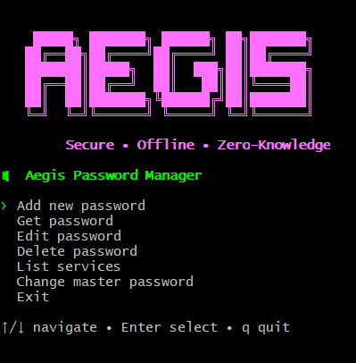

# 🛡️ Aegis

**Aegis** is a secure, offline-first, zero-knowledge **CLI password manager** with an interactive TUI.

> Your secrets never leave your machine.

---

## 📸 Screenshot


---

## ✨ Features

- 🔐 Zero-knowledge encryption (AES-256-GCM)
- 🧠 Master password–based key derivation (scrypt)
- 🗄️ Encrypted local vault (SQLite)
- 🖥️ Interactive TUI (arrow-key navigation)
- 🧹 Clean CLI commands (`add`, `get`, `edit`, `delete`)
- 🔒 No cloud, no tracking, no telemetry

---

## 🔐 Security Model (Short)

- Master password is **never stored**
- Encryption key is derived using **scrypt**
- All secrets are encrypted using **AES-GCM**
- Vault integrity is verified on every unlock
- If you forget your master password, **data cannot be recovered**

---

## ⚠️ Security Notes

- There is NO password recovery
- There is NO backdoor
- Losing your master password means losing access forever
- Vault file should be kept private

---

## 🧠 Threat Model (Brief)

Aegis protects against:
- Local file theft
- Offline brute-force attacks
- Accidental plaintext exposure

Aegis does NOT protect against:
- Compromised operating systems
- Keyloggers
- Malicious terminal environments

---

## 🚀 Quick Start
Initialize vault:
```bash 
./aegis init
```
Add a password:
```bash 
./aegis add
```
Get a password:
```bash
./aegis get [servicename]
```

---

## 🖥️ Interactive Mode (Recommended)

```bash
./aegis start
```
Navigate using:
- ↑ ↓ arrow keys
- Enter to select
- q / esc to exit

---

## 📦 Installation
 Build from source

```bash
git clone https://github.com/whozdeez/aegis.git
cd aegis
go build -o aegis ./cmd/aegis
```

--- 

## 📜 Disclaimer
This project is for educational and personal use.
Use at your own risk.
